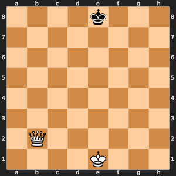
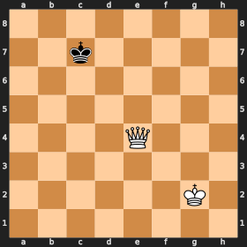
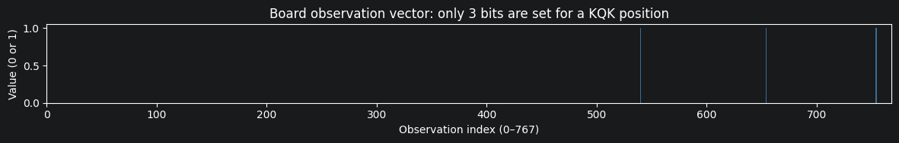

### imports


```
import sys, os
sys.path.insert(0, os.path.dirname(os.path.abspath("__file__")))

import chess.svg
import numpy as np
import matplotlib.pyplot as plt
from IPython.display import SVG, display

import utils.board as b
```

# Notebook 1: The Chess Environment

The KQK endgame environment used to train the agent. Covers the board representation, action space, reward function, and how they evolved across versions.

## 1. The KQK Endgame

**For anyone reading that is unfamiliar with chess:**

### Pieces
| Piece | How it moves |
|-------|--------------|
| King ♔ / ♚ | One square in any direction |
| Queen ♕ | Any number of squares in any direction |

### How games end
- **Checkmate**: the king is under attack with no escape → white wins
- **Stalemate**: black has no legal moves but is *not* in check → draw, white failed
- **Draws**: threefold repetition, fifty-move rule (50 moves without a capture), or only two kings left

### Why KQK?
King + Queen vs lone King. White must corner and checkmate the black king.

Starting here because:
- Only 3 pieces, simple rules
- Checkmate is clear and frequent enough to get a learning signal
- It's not trivial, a random policy mostly produces draws
- Hopefully scales to harder endgames


```
board = chess.Board("4k3/8/8/8/8/8/1Q6/4K3 w - - 0 1")
display(SVG(chess.svg.board(board, size=300)))
```


    

    


## 2. Board → Observation (768-dimensional vector)

The network needs a fixed-size numerical input. We encode the board as a flat binary vector of length 768:

```
obs[(piece_type - 1) * 128 + color * 64 + square] = 1.0
6 piece types (king, queen, rook, horse, bishop, pawn) × 2 colors × 64 squares = 768
```

In a KQK position, exactly 3 of the 768 values are 1.

### Why a flat vector and not a convolutional network?
The alternative is to represent the board as stacked 8×8 grids (one per piece type/color) and process them with a CNN, that's what AlphaZero (a big chess engine) does. Convolutions are good at picking up spatial patterns, but KQK only has 3 pieces and not much spatial structure to exploit. A flat vector fed into a plain MLP is simpler and works more than well in the testing I did. But a CNN could be better in the future.


```
# Visualize: board → observation vector
board = b.random_kqk_position()
obs   = b.board_to_obs(board)

display(SVG(chess.svg.board(board, size=280)))

# Show which indices are non-zero
non_zero = np.where(obs > 0)[0]
piece_names = ["Pawn", "Knight", "Bishop", "Rook", "Queen", "King"]
colors      = ["White", "Black"]

print(f"Non-zero positions in obs (total = {len(non_zero)}):")
for idx in non_zero:
    pt_idx  = idx // 128
    color   = (idx % 128) // 64
    square  = idx % 64
    sq_name = chess.square_name(square)
    print(f"  obs[{idx:4d}]  {colors[color]:6s} {piece_names[pt_idx]:7s} on {sq_name}")

fig, ax = plt.subplots(figsize=(12, 2))
ax.bar(range(len(obs)), obs, width=1.0, color="steelblue", alpha=0.8)
ax.set_xlabel("Observation index (0–767)")
ax.set_ylabel("Value (0 or 1)")
ax.set_title("Board observation vector: only 3 bits are set for a KQK position")
ax.set_xlim(0, 768)
plt.tight_layout()
plt.show()
```


    

    


    Non-zero positions in obs (total = 3):
      obs[ 540]  White  Queen   on e4
      obs[ 654]  White  King    on g2
      obs[ 754]  Black  King    on c7


    

    


## 3. Action Space (4096 discrete actions)

Every square-to-square move gets a unique integer:

```
action = from_square * 64 + to_square  →  range [0, 4095]
```

Only about 10–30 of these 4096 actions are legal in any given position. Before sampling, illegal moves are zeroed out:
```python
mask = torch.full((4096,), float('-inf'))
mask[legal_actions] = 0.0
probs = softmax(logits + mask)
```

### Why fixed 4096 and not just list the legal moves?
The number of legal moves changes every step. A fixed output size means one network handles every position without needing a variable-size output.


```
# Show: legal actions for a sample position
board = chess.Board("4k3/8/8/8/8/8/1Q6/4K3 w - - 0 1")
legal_actions = [b.move_to_action(m) for m in board.legal_moves]
legal_moves   = [board.san(m) for m in board.legal_moves]

print(f"Board: {board.fen()}")
print(f"Legal move count: {len(legal_actions)}")
print()
for action, san in sorted(zip(legal_actions, legal_moves)):
    from_sq = action // 64
    to_sq   = action % 64
    print(f"  action={action:4d}  from={chess.square_name(from_sq)}  to={chess.square_name(to_sq)}  SAN={san}")
```

    Board: 4k3/8/8/8/8/8/1Q6/4K3 w - - 0 1
    Legal move count: 28
    
      action= 259  from=e1  to=d1  SAN=Kd1
      action= 261  from=e1  to=f1  SAN=Kf1
      action= 267  from=e1  to=d2  SAN=Kd2
      action= 268  from=e1  to=e2  SAN=Ke2
      action= 269  from=e1  to=f2  SAN=Kf2
      action= 576  from=b2  to=a1  SAN=Qa1
      action= 577  from=b2  to=b1  SAN=Qb1
      action= 578  from=b2  to=c1  SAN=Qc1
      action= 584  from=b2  to=a2  SAN=Qa2
      action= 586  from=b2  to=c2  SAN=Qc2
      action= 587  from=b2  to=d2  SAN=Qd2
      action= 588  from=b2  to=e2  SAN=Qe2+
      action= 589  from=b2  to=f2  SAN=Qf2
      action= 590  from=b2  to=g2  SAN=Qg2
      action= 591  from=b2  to=h2  SAN=Qh2
      action= 592  from=b2  to=a3  SAN=Qa3
      action= 593  from=b2  to=b3  SAN=Qb3
      action= 594  from=b2  to=c3  SAN=Qc3
      action= 601  from=b2  to=b4  SAN=Qb4
      action= 603  from=b2  to=d4  SAN=Qd4
      action= 609  from=b2  to=b5  SAN=Qb5+
      action= 612  from=b2  to=e5  SAN=Qe5+
      action= 617  from=b2  to=b6  SAN=Qb6
      action= 621  from=b2  to=f6  SAN=Qf6
      action= 625  from=b2  to=b7  SAN=Qb7
      action= 630  from=b2  to=g7  SAN=Qg7
      action= 633  from=b2  to=b8  SAN=Qb8+
      action= 639  from=b2  to=h8  SAN=Qh8+


## 4. Reward Function

| Version | Checkmate | Draw | Step penalty | Missed mate | Queen hang |
|---------|-----------|------|-------------|-------------|------------|
| env v1  | +1.0      | −1.0 | −0.001/step | —           | —          |
| env v2  | +10.0     | −1.0 | −0.001/step | —           | −0.5       |
| env v3  | +10.0     | −1.0 | −0.15/step  | −3.0        | −5.0       |
| env v4  | +10.0     | −1.0 | −0.15/step  | −3.0        | −5.0       |

### What each signal does

**Step penalty**: discourages stalling. Without it, the agent is happy to shuffle pieces for 200 steps.

**Missed-mate penalty** (−3.0): white had a checkmate available but didn't play it — end the episode with a penalty. Added after watching the agent skip mates it had seen hundreds of times.

**Queen-hang penalty** (−5.0): white moved the queen to a square the black king can immediately take — end the episode. Eliminated the agent's habit of sacrificing its only powerful piece.

**Checkmate scaling** (+1 → +10): bigger signal, easier to learn from early on.

## 5. Curriculum Learning

From a random KQK position, the agent might need 15–20 correct moves to reach checkmate. With random early actions, it almost never gets there; so there's nothing to learn from.

### Solution: mate-in-1 pool
I collected positions where white has an immediate checkmate available.
Each episode starts either from one of these (probability = curriculum_ratio) or from a random position.

```python
if random.random() < curriculum_ratio:
    board = chess.Board(random.choice(mate_pool))
else:
    board = random_kqk_position()
```

The agent sees checkmates constantly early on. Once it knows how to finish, we lower the ratio so it has to learn to get there from harder positions.

### Finding the right ratio
`1.0` (all mate-in-1): learns finishing fast, can't build a mating position from nothing.  
`0.0` no mate-in-1 in one positions

## 6. Opponent Strategies

The environment controls the black king's moves.

| Env version | Opponent                                          |
|-------------|---------------------------------------------------|
| v1          | Random legal move                                 |
| v2          | Centrality heuristic or random (`movement_ratio`) |
| v3          | Any callable, used for neural network opponent    |

### Centrality movement (env v2)
The black king moves to whichever square is closest to the center:
```python
centrality(sq) = min(file(sq), 7 - file(sq), rank(sq), 7 - rank(sq))
```
A king in the center has more escape squares and is impossible to checkmate.

### Neural network opponent (env v3)
`opponent_fn(obs, legal_actions) → action` accepts any callable. We trained a `PPOOpponent` that plays as black and tries to survive as long as possible.

## 7. Episode Termination Conditions

| Condition                 | Reward  | Notes                                                            |
|---------------------------|---------|------------------------------------------------------------------|
| **Checkmate**             | +10.0   | White wins                                                       |
| **Stalemate**             | −1.0    | Black has no legal move but is not in check: draw, white failed  |
| **Insufficient material** | −1.0    | Happens if the queen gets captured                               |
| **Threefold repetition**  | −1.0    | Same position 3 times                                            |
| **Fifty-move rule**       | −1.0    | 50 moves without progress                                        |
| **Missed mate**           | −3.0    | White had a checkmate available and didn't play it               |
| **Queen hang**            | −5.0    | White left the queen where the black king can take it            |
| **Timeout**               | 0.0     | 200 steps reached                                                |

Missed mate and queen hang are not standard chess rules, they were added to penalise obvious mistakes immediately rather than waiting for the effect to show up many moves later.
