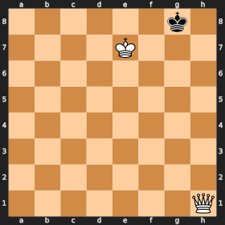
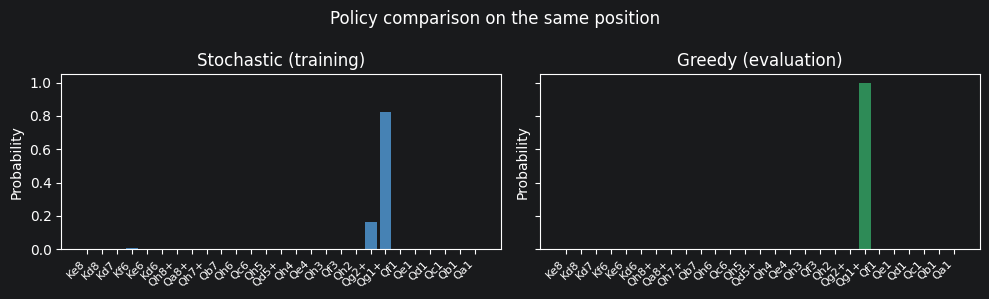

### imports


```
import sys, os
sys.path.insert(0, os.path.dirname(os.path.abspath("__file__")))

from agents.v7.ppo_agent import ActorCritic
from agents.v7.ppo_agent import PPOAgent
import torch
import numpy as np
import matplotlib.pyplot as plt
import chess.svg
from IPython.display import SVG, display

import utils.board as b
```

# Notebook 2: The Agent

Network architecture, policy types, and the algorithm progression from REINFORCE to A2C to PPO.

## 1. Why a Neural Network and Not a Q-table?

A Q-table stores a value for every (state, action) pair. For small problems it's fine. For chess it doesn't work.

### The numbers
- KQK has millions of distinct positions. Full chess has more than 10⁴⁰.
- We have 4096 possible actions.
- A Q-table for just 1M KQK states would need ~4 billion entries.
- No generalisation: a position with the king on e4 and one with the king on e5 are completely separate entries, even though the right strategy is nearly identical.

### Why a neural network?
The network has ~700k parameters. Similar positions get similar outputs because the weights are shared. Anything the agent learns in one position carries over to positions that look like it.


```
table_states  = 1_000_000
table_actions = 4096
q_table_size  = table_states * table_actions

net_params = (768*256 + 256) + (256*256 + 256) + (256*4096 + 4096) + (256 + 1)
print(f"Q-table size (1M states × 4096 actions): {q_table_size:,} entries")
print(f"Neural network parameters:               {net_params:,}")
print(f"Ratio: {q_table_size / net_params:.0f}× more entries in Q-table")
```

    Q-table size (1M states × 4096 actions): 4,096,000,000 entries
    Neural network parameters:               1,315,585
    Ratio: 3113× more entries in Q-table


## 2. Neural Network Architecture

The input is the 768-dimensional board vector described in Notebook 1 (6 piece types × 2 colors × 64 squares).

```
Input (768)
    ↓
Linear(768 → 256) + ReLU
    ↓
Linear(256 → 256) + ReLU
    ↓  ← shared backbone
   / \
Actor    Critic
Linear   Linear
(256→4096) (256→1)
  logits    V(s)
```

### Why share the backbone?
Both the Actor (policy: what to play) and the Critic (value estimate: how good is this position) need to understand the board. Sharing the lower layers means both heads train on the same representation; fewer parameters, same expressiveness.

### REINFORCE (v1–v4): actor only
The early agents have no critic, just the backbone → 4096 logits. The value head was added in v5 with A2C.


```
# Show network architecture and parameter breakdown

net = ActorCritic(hidden=256)

print("ActorCritic architecture:")
print(net)
print()
total = 0
for name, p in net.named_parameters():
    print(f"  {name:40s}  shape={str(list(p.shape)):20s}  params={p.numel():,}")
    total += p.numel()
print(f"\nTotal parameters: {total:,}")
```

    ActorCritic architecture:
    ActorCritic(
      (backbone): Sequential(
        (0): Linear(in_features=768, out_features=256, bias=True)
        (1): ReLU()
        (2): Linear(in_features=256, out_features=256, bias=True)
        (3): ReLU()
      )
      (actor): Linear(in_features=256, out_features=4096, bias=True)
      (critic): Linear(in_features=256, out_features=1, bias=True)
    )
    
      backbone.0.weight                         shape=[256, 768]            params=196,608
      backbone.0.bias                           shape=[256]                 params=256
      backbone.2.weight                         shape=[256, 256]            params=65,536
      backbone.2.bias                           shape=[256]                 params=256
      actor.weight                              shape=[4096, 256]           params=1,048,576
      actor.bias                                shape=[4096]                params=4,096
      critic.weight                             shape=[1, 256]              params=256
      critic.bias                               shape=[1]                   params=1
    
    Total parameters: 1,315,585


## 3. Legal Move Masking

The network outputs 4096 logits. Before sampling, illegal moves are set to −∞:

```python
mask = torch.full((4096,), float('-inf'))
mask[legal_actions] = 0.0
probs = softmax(logits + mask)
```
Legal moves: logit unchanged. Illegal moves: sent to −∞, so softmax gives them probability ≈ 0.

The network can never accidentally pick an illegal move.

## 4. Policy Types

### Stochastic (used during training)
```python
probs  = softmax(logits[legal_actions])
action = multinomial_sample(probs)
```
Random draws proportional to probability. The same position can give different moves needed for exploration.

### Greedy (used during evaluation)
```python
action = legal_actions[argmax(logits[legal_actions])]
```
Always picks the highest-probability move. Deterministic. Used to report checkmate rates.

## 5. Algorithm Progression: REINFORCE → A2C → PPO

### REINFORCE (agents v1–v4)

```
loss = −∑ₜ log π(aₜ|sₜ) · Gₜ
```

`Gₜ` is the discounted return from step t. Increase the probability of moves that appeared in good episodes, decrease it in bad ones.
The problem: `Gₜ` depends on everything that happens after step t, which is noisy. The algorithm learns but slowly.

---

### A2C — Advantage Actor-Critic (agent v5)

Adds a critic `V(s)` that estimates expected return from each position.
The actor updates on the advantage instead:

```
Aₜ = Gₜ − V(sₜ)
```

`Aₜ > 0`: this action did better than expected → increase its probability.  
`Aₜ < 0`: this action did worse than expected → decrease it.

The critic removes the noisy floor from the gradient.

---

### PPO — Proximal Policy Optimization (agents v6–v7)

Limits how much the policy can change per update:

```
ratio = π_new(a|s) / π_old(a|s)
loss  = −min(ratio · A, clip(ratio, 1−ε, 1+ε) · A)
```

If the new policy is pulling too far from the old one, the goal clamps it. Prevents large updates that destabilize training.

## 6. Future Extensions: Minimax and MCTS

The current policy is just `(obs, legal_actions) → action`. It can be swapped without touching the training loop or the environment.

### Minimax
```python
def minimax_policy(board, depth=3):
    for move in board.legal_moves:
        board.push(move)
        score = -minimax(board, depth - 1, -inf, inf)
        board.pop()
    return best_move
```
No neural network; just a tree search. Slow for large depths, useful as a near-perfect benchmark.

### MCTS
```python
def mcts_policy(board, net, n_simulations=1000):
    root = MCTSNode(board)
    for _ in range(n_simulations):
        root.simulate(net)  # actor head → move prior, critic head → position value
    return root.best_action()
```

### Why not now?
KQK checkmate is reachable in ≤ ~10 moves from any position. A greedy neural policy is enough here. For harder endgames, deeper search might be needed.

## 7. Demo: Load the Best Agent


```
MODEL_PATH = "../notebooks/models/kqk_ppo_with_opponent_v1_stage_2.pt"

agent = PPOAgent(curriculum_ratio=0.0)
try:
    agent.net.load_state_dict(torch.load(MODEL_PATH, map_location="cpu"))
    agent.net.eval()
    print(f"Loaded model from {MODEL_PATH}")
    model_loaded = True
except FileNotFoundError:
    print(f"Model file not found at {MODEL_PATH}")
    print("Proceeding with untrained network for demonstration purposes.")
    model_loaded = False
```

    Using device: cuda
    Loaded model from ../notebooks/models/kqk_ppo_with_opponent_v1_stage_2.pt


```
DEVICE = next(agent.net.parameters()).device
board  = b.random_kqk_position()
obs    = torch.FloatTensor(b.board_to_obs(board)).unsqueeze(0).to(DEVICE)
legal  = [b.move_to_action(m) for m in board.legal_moves]

with torch.no_grad():
    logits, value = agent.net(obs)
logits = logits.squeeze(0).cpu()
raw    = logits[legal].float()

greedy_idx  = raw.argmax().item()
greedy_act  = legal[greedy_idx]
stoch_probs = torch.softmax(raw, dim=0).numpy()

display(SVG(chess.svg.board(board, size=280)))
print(f"Position value (critic): V(s) = {value.item():.3f}")
print(f"Legal moves: {len(legal)}")
print(f"Greedy move: {board.san(b.action_to_move(greedy_act))}  (prob = {stoch_probs[greedy_idx]:.3f})")

fig, axes = plt.subplots(1, 2, figsize=(10, 3), sharey=True)
moves_san = [board.san(b.action_to_move(a)) for a in legal]
x = range(len(legal))

axes[0].bar(x, stoch_probs, color="steelblue")
axes[0].set_title("Stochastic (training)")
greedy_probs = np.zeros(len(legal)); greedy_probs[greedy_idx] = 1.0
axes[1].bar(x, greedy_probs, color="seagreen")
axes[1].set_title("Greedy (evaluation)")

for ax in axes:
    ax.set_xticks(x); ax.set_xticklabels(moves_san, rotation=45, ha="right", fontsize=8)
    ax.set_ylabel("Probability")
plt.suptitle("Policy comparison on the same position")
plt.tight_layout()
plt.show()
```


    

    


    Position value (critic): V(s) = 8.408
    Legal moves: 27
    Greedy move: Qg1+  (prob = 0.825)


    

    


With a stochastic agent during evaluation it will sometimes choose a different move in the same position. So during evaluation I use a greedy agent.


```
# Animate a full game (interactive in Jupyter)
agent.animate_game(greedy=True, movement_ratio=1.0)
```


    VBox(children=(HBox(children=(Play(value=0, description='Play', interval=600, max=11), IntSlider(value=0, layo…

